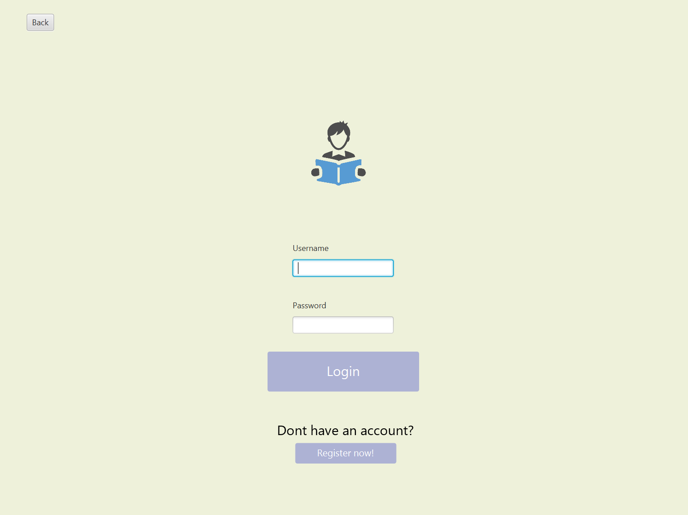
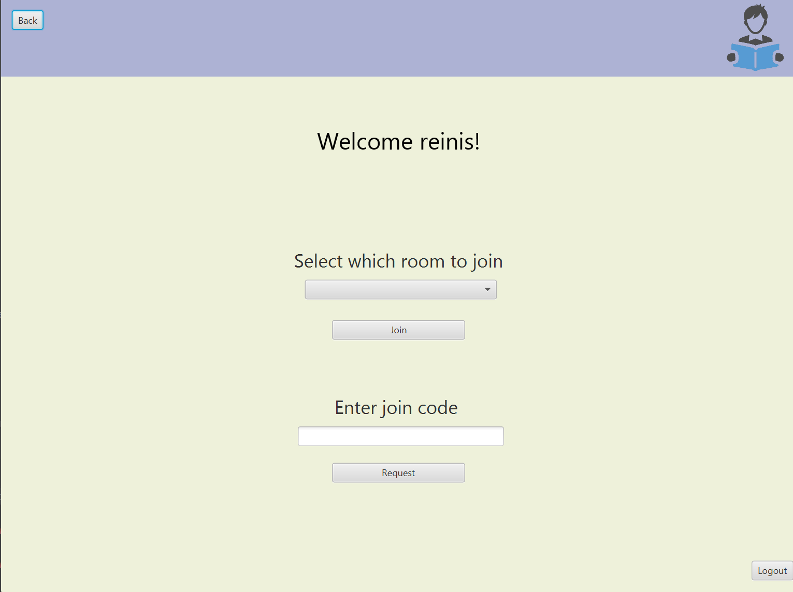
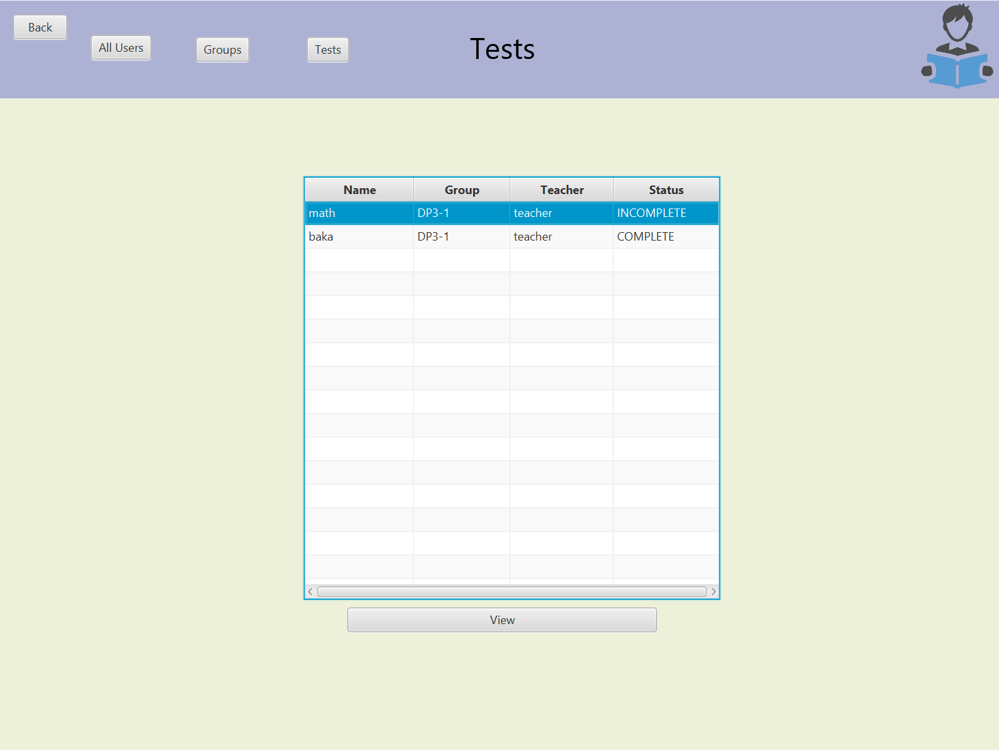

# StudyFlow

**StudyFlow** ir ērta platforma, kas palīdz viegli pārvaldīt skolēnus, ļaujot veidot vairākas klases un skolotājiem likt atzīmes. Skolēni var salīdzināt savas sekmes ar citiem un redzēt, kā viņiem veicas laika gaitā.


## Saturs
1. [Funkcijas](#funkcijas)
2. [Attēli no aplikācijas](#attēli-no-aplikācijas)
3. [Lietotāja ceļvedis](#lietotāja-ceļvedis)
4. [Instalēšanas soļi](#instalēšanas-soļi)
5. [Koda ieskats](#koda-ieskats)

## Funkcijas
- Piereģistrēšanās vairākās klasēs
- Studentu pievienošana grupās
- Pārbaudes darbu izveide un vērtēšana
- Statistika par skolēnu atzīmēm

## Attēli no aplikācijas
| Pieslēgšanās                                      | Galvenā lapa                                     | Testi                                             |
|---------------------------------------------------|--------------------------------------------------|---------------------------------------------------|
|  |  |  |
## Lietotāja ceļvedis
Lejuplādē un palaid aplikāciju (skat. [Lejuplādes soļi](#instalēšanas-soļi))

**Priekš skolotājiem**
1. Izveido savu skolotāja kontu
2. Izveido vai pievienojies jau gatavai klasei
3. Apstiprini skolēnus klasei (ja esat klases galvenais)
4. Uzdodat pārbaudes darbus
5. Vērtējiet pārbaudes darbus
6. Pārvaldies skolēnus

**Priekš skolēniem**
1. Izveido savu skolēna kontu
2. Pievienojies kādai izveidotai klasei
3. Pildi uzdotos pārbaudes darbus
4. Salīdzini savu iegūto rezultātu ar citiem skolēniem savā grupā
## Instalēšanas soļi
1. **Lejuplādē projektu** 
- Atver StudyFlow repozitoriju un lejuplādē ZIP failu
2. **Atarhīvēt ZIP failu**
- Ar labo peles taustiņu uzpied uz lejuplādētā ZIP faila un uzpied "Extract all"
3. **Lejuplādē Java Development Kit (JDK)**
- Lejuplādē JDK 17 vai augstāku lai palaistu programmu
4. **Lejuplāde Apache Maven**
- Lejuplādē Maven šeit [Oracle JDK](https://www.oracle.com/java/technologies/javase-downloads.html) vai [OpenJDK](https://jdk.java.net/)
5. **Koda redaktors**
- Lejuplādē jebkādu koda redaktoru (piemēram IntelliJ IDEA, Visual Studio Code)
6. **Palaišana**
- Lejuplādē visus nepieciešamos paplašinājumus un uzpiežiet "RUN" pogu

## Koda ieskats
**Zemāk ir redzamas funkcijas no aplikācijas**

Pieslēgšanās savam kontam
```java
public User login(String username, String password) throws UserNotFoundException, InvalidCredentialsException, InputFieldEmptyException {

    User user = userService.getUserByUsername(username);

    if(username.isBlank() || password.isBlank()){
        throw new InputFieldEmptyException("cannot leave fields empty");
    }

    if(user == null){
        throw new UserNotFoundException("user with that username doesnt exist!");
    }

    if(!user.getPassword().equals(password)){
        throw new InvalidCredentialsException("incorrect password");
    }


    session.setLoggedInUser(user);

    return user;
}
```

Iegūst visus studentus no istabas
```java
    public List<User> getAllStudentsInRoom(int roomId) throws RoomNotFoundException, UserNotFoundException {
        Room room = roomService.getRoomById(roomId);

        List<User> users = new ArrayList<>();
        for(int i = 0; i<room.getUsers().size(); i++){
            User user = userService.getUserById(room.getUsers().get(i).getUser());
            if(user.getUserType() == UserRole.STUDENT){
                users.add(user);
            }
        }
        return users;
    }
```

## Saites
Mājaslapa- https://study-flow-website-s1bq.vercel.app/

